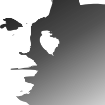
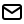
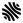

```{=html}
<!--
<script>
let author = document.getElementsByClassName("author")[0];
repl = `<div style="width:5em;">
  </img>
  <div style="display:inline-block;">
  <p><a href="mailto:Sebastien.Boisgerault@minesparis.psl.eu">Sébastien Boisgérault</a>, Mines Paris – PSL University</p>
  </div>
</div>`
author.outerHTML = repl
</script>
-->
```

```{=html}
<script>
let author = document.getElementsByClassName("author")[0];
author.outerHTML = `
  <p><a href="mailto:Sebastien.Boisgerault@minesparis.psl.eu">Sébastien Boisgérault</a>, Mines Paris – PSL University</p>
  <p style="display: flex; align-items: center;">
  <a href="mailto:Sebastien.Boisgerault@minesparis.psl.eu"><span style="display:inline-block;height:24px;margin-right:24px;"></img></span></a>
  <a href="https://github.com/boisgera"><span style="display:inline-block;height:24px;margin-right:24px;"></img></span></a>
  <a href="https://twitter.com/boisgera"><span style="display:inline-block;height:24px;margin-right:24px;"></img></span></a>
  <a href="https://hal.science/search/index/?q=%22S%C3%A9bastien+Boisg%C3%A9rault%22&rows=30&sort=producedDate_tdate+desc">
  <span style="display:inline-block;height:24px;margin-right:24px;"></img></span></a>
  </p>`
let date = document.getElementsByClassName("date")[0];
date.outerHTML = ""
</script>
```


  - 🦫 [**Go Programming**](https://eul.ink/go)

  - 🧮 [**Calculus**](https://github.com/boisgera/CDIS#calcul-diff%C3%A9rentiel-int%C3%A9gral-et-stochastique)

  - 🐍 [**Python**](https://github.com/boisgera/python-fr#python-)

  - 📈 [**Data Science**](data-science)

  - 🧞 [**Control Engineering**](https://github.com/boisgera/control-engineering-with-python#control-engineering-with-python)

  - 💻 [**Software Engineering**](software-engineering)

  - 🧮 [**Complex Analysis**](complex-analysis)

  - 🪃 [**Delay Systems**](delay-systems)

  - 🎧 [**Digital Audio**](audio)

  - 🤗 [**Open Source**](open-source)

  - ❄️ [**Shape Optimization**](shape-optimization)

  - 🖺 [**Pandoc**](pandoc)

  - 🤖 [**Robotics**](robotics)

  - 📖 [**Open Education**](ICTE)

<script>
$("head").append("<link rel='shortcut icon' href='ink.png' type='image/png'>")
</script>

